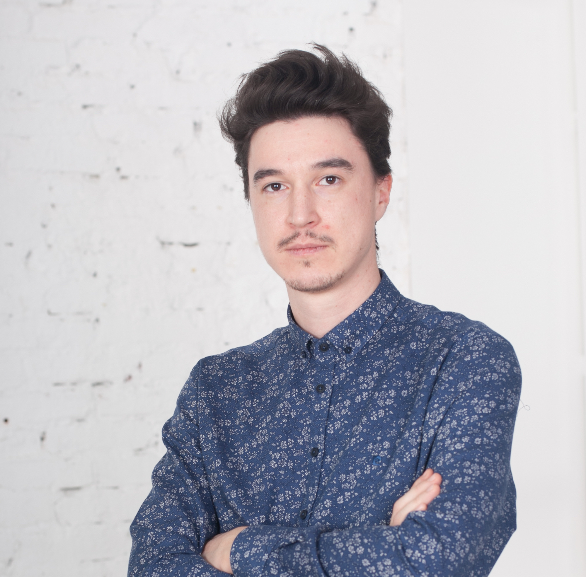

My name is Rustem Mustafin. Currently, I work as a PM at Akvelon. This page will mostly cover my professional skills, however, I also have a beautiful family: a wife and a son. You can contact me via:

-   Email: `mustafin.rustem [at] gmail.com`

-   Skype: `rulonerulone`

-   Twitter: [@Rulikkk](https://mobile.twitter.com/rulikkk)

I have started working with IT in 2005. Right now, I am leading Akvelon's Kazan office with 110+ people, boosting their growth and managing delivery of every project: from two-developer gangs to large 20+ personnel teams.

# My Skills

I mosly work in **management.** Right now I am responsible for every success and failure of everyone in our office. Yet, I am also capable of managing teams of 3-20 people: developers, quality assurance engineers, designers, devOps; Working using Agile, with JIRA/tfs/redmine, planning, estimating, doing requirement analysis, writing docs, approving and demonstrating results to client.

I also know some **cloud development:** production experience using Microsoft Azure, HP Helion OpenStack. Familiar with Amazon Web Services, Google Cloud Platform, Heroku and smaller ones.

More details in [my LinkedIn](https://www.linkedin.com/in/rustem-mustafin-8a148368).

<!-- Here is a list of some more items, that I know:

**Serverside:** .Net c# or javascript. Web servers: iis, node.js. Sql databases: oracle (administration), postgres, mssql, sqlite. Nosql: mongodb. Technonlogies: hadoop, socket.io, Wcf, Rest.

**Web:** Html5, backbone, angular (1-2), ext.js, vanilla.js, es6/typescript, etc.

**Mobile:** Android: native Java/cordova. Ios: sencha/cordova. Windows: Wpf/WinForms. React Native.

# My Projects

## [Ivan Rides](//ivanthebot.github.io)

`(2016 - now, self-made)`

Ivan Rides is a telegram bot, that gets you an Uber where you need it. The main idea was to jump on the bot-market train and see capabilities of the bots in general, using Uber integration as an example. The bot was developed using Python lang and hosted in Azure. The second version was re-done in NodeJS + Typescript.

## CRM Online Marketplace

`(2015 - now, Akvelon)`

Main project goal is to build an application exchange platform and a partner program in the context of CRM Online. Deliver a competitive ISV ecosystem from a technology enablement standpoint.

## Microscopy Image Analysis

`(2015 - now, Akvelon)`

Cloud-first solution which allows scalable processing, storage and visualization of microscopy image data analysis and technical approach. Main project goals are to perform fast, distributed processing of large datasets (up to 100Gb of images) and conveniently visualize processing results.

## Hewlett-Packard (HP) Interactive Wall

`(2015, Akvelon)`

Project is an internal HP website that is used during conferences/presentations. The main goal is to present conference material in an immersive UI, suitable for different screen sizes. From phone/tablet to huge TV screens. Website allows user authentication using conference badge, which unlocks possibility to send material of user interest directly to his or her email address, specified at registration.

## HP Big Data

`(2015, Akvelon)`

Automated approach for private OpenStack-based cloud Hadoop cluster deployment, primarily based on Ansible automation; developed sample data generator using node.js, capable of producing huge amounts of JSON data with pre-set trends; implemented gathering generated data to HDFS using Flume; implemented data analysis using Pig script, which detected predefined trends in generated data.

## Innovation challenge

`(2015, Akvelon)`

Innovation challenge project helps build a sustainable US food system by putting USDA data into the hands of farmers, researchers, and customers. It is a cloud-first Azure application, which hosts and provide convenient RESTful access to US agricultural data.

## Capella

`(2015, iis-soft)`

OSS solution for providing different citizen services at single office via integration with multiple government and private web services. Developed HTML5 web version of Capella desktop application.

## Smart home

`(2013 — 2014, KT Labs)`

Lead a team of 5 developers, QA and business analyst in a large project, including almost all technologies mentioned below, plus iOs/android mobile apps (android app was developed by me). Interaction with customer (o7russia portal owned by rostelecom) about technical details of project, help in preparation of documentation for project.

## [Disciplina](//disciplina.ru)

`(2013 — 2014, KT Labs)`

As part of team, developed worktime-tracking software "Disciplina". It included a website, where users could see how their time is spent and a local application, which tracks active apps, visited sites, activity and many other small parameters. The solution could be deployed on premises or as SaaS. It was also capable of telling "productive" time, based on employee position. My tasks covered almost every aspect of solution.

# List of Companies

## Akvelon

`2015 — now, Project manager`

Managing Kazan's office and development process in teams, using agile, test-driven methodology. Requirement analysis, planning, estimates, writing technical/development documents, interaction with customer. Standardizing development process.

# IIS-Soft

`2014 — 2015, team-lead`

Working as a team-lead on "Capella" project.

**New key skills:** project management (plan, estimate, build, deliver), resource and team planning, interacting with customer, development process management.

# KT Labs

`2012 — 2014, team-lead`

Working as a team-lead, as described above.

Also, I was developing server and client sides for several projects using c# (iis) or node.js with postgres or mongo, ext.js or backbone with other libs for client side. Took part in online collaboration tool, business intelligence development. Taking part in company technology decisions, including starting to use automated deploy, continuous integration.

**New key skills:** team leading/management, Html5, node.js, .Net web development, many js libraries, CI.

## Sitronics TS

`2010 — 2012, senior developer/architect`

Took part as a developer/architect within FORIS OSS/BSS system. I was writing architectural solution documents, according to company-wide standards. As a developer, I used Oracle and PL/SQL (probably, this might be called big data), C# as a language and WinForms for presentation purposes.

Learned to write good documents and how to deal with millions records per month in DB, writing stable and error-prone code. Got experience in customer interaction during deployment/learning phase.

**New key skills:** system architecture decisions, oracle db management, stable error-prone code.

## Amfitel

`2007 — 2010, .net/oracle developer`

Was an outsourced developer in FORIS OSS/BSS system. Started using .Net in production. Developed product/project level features. Oracle and pl/sql for db-side.

**New key skills:** production .Net, oracle, pl/sql, WinForms.

`2005 — 2007, delphi developer`

Started being a developer. By that time I knew Pascal from school/university. Developed an OSS/BSS solution "M2000" used by local telecom companies.

**New key skills:** writing production code, working in a team, win api, vcl.

# Additional list of small, but important things

In 2013, took part as a server-side developer (made a proxy web-controller from one API to another) in a Scala-Play (Java based) framework. Got a little experience in this language.

In 2013, made a js libraries research for our company, including knockout, breeze, durandal, angular, SPA templates for .net and many other, to adopt some instead backbone.

In 2012, helped a little in a ruby on rails project. Than, tested ruby as a programming language on private projects. Now I also have some experience in this language and framework.

Since around 2010 trying to catch up with F# features and other functional-style programming techniques. Tried using python as a language to solve some ACM programming challenges.

Since 2002, while still studying, took part in many ACM-like local challenges, and got to know much about extreme programming, standard algorithms and data-structures, O-notation.

# Education

## Kazan State University 2004 — 2009

Studied at Computing Maths and Cybernetics department, successfully received higher education and graduated as a specialist in 2009. Before and in the university took part in several local programming challenges (ACM-like rules), showed good results in 2004, and was invited to university without examination.

## Schools 1994 — 2004

Learned in two local schools, from one I knew english very well, from another — started learning programming.
 -->
