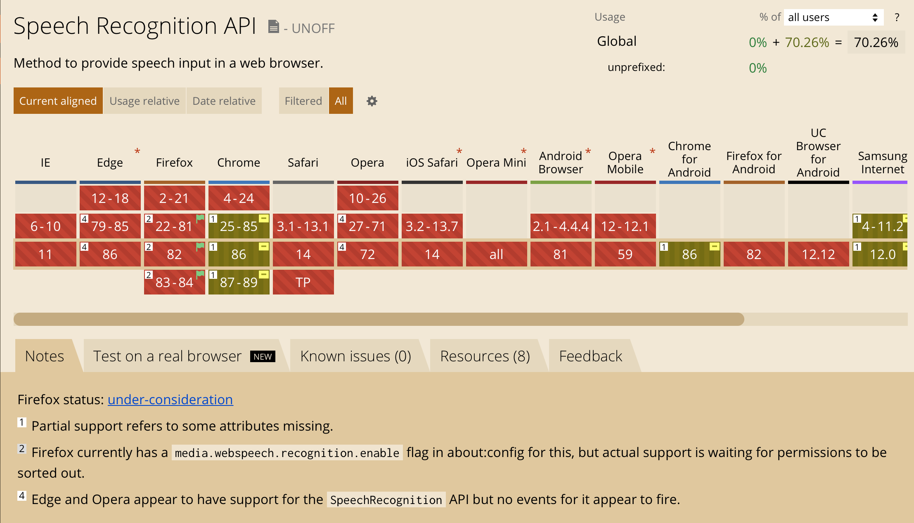

"Digit Tutor" — a simple online game for kids in Svelte, which uses speech
recognition engine to train pronounciation of digits: from "0" to "9".

### ✳️ <a href="https://digit-tutor.rmust.me" target="_blank">Open Digit Tutor</a>

The project is [open-source](https://github.com/Rulikkk/digit-tutor), so, feel
free to send a PR, if you wish!

> This post is part of a series about building Digit Tutor, that include:
>
> 1. [Building “Digit Tutor” — Part 1: Svelte](/building-digit-tutor-part-1-svelte)
> 2. [Building “Digit Tutor” — Part 2: Speech Recognition](/building-digit-tutor-part-2-speech-recognition)
>    (this page)
> 3. [Building “Digit Tutor” — Part 3: Internationalization](/building-digit-tutor-part-3-internationalization)

# Intro

If you're interested in details on how "Digit Tutor" started and was built in
Svelte, please, refer to the
[first article](/building-digit-tutor-part-1-svelte) in the series.

This article covers the details of speech recognition — how it works, which
browsers support it and how I have used it.

# Can I use SpeechAPI?

Speech recognition in the app is based on
[SpeechAPI](https://developer.mozilla.org/en-US/docs/Web/API/Web_Speech_API). It
is not really supported in many browsers, as of now:
https://caniuse.com/speech-recognition. Here is a screenshot of that page at the
time of writing this text:



As you see, the support matrix can be quickly described as "chrome-only",
however, Firefox can also support it with some config. Other browsers either
don't support it at all, or have required objects in `window`, which do nothing.

So, it is definitely **not ready** for cross-browser production usage, but fits
for experiments, like our game.

# Technology

As you might guess, speech recognition in browsers contains of three parts:

- **Grammar**: defines a set of words, which you're interested in & which will
  be recognized
- **Synthesis**: allows browser to talk to you
- **Recognition**: allows browser to convert speech to text

Logically, there might also be something like "intent recognition", to
understand what the user really means, but it seems that current technology
state does not allow to do that reliably.

At first, and very logically, I thought I would need to support _Grammar_ and
_Recognition_ in my game. Later, during the testing stages, I've figured out,
that _grammar_ part is not used at all, so I could only focus on _recognition_.

## A Word on Chrome Implementation

It turned out, that Chrome has very peculiar speech recognition implementation:

1. Actual recognition might happen on Google's servers, per
   [this MDN article](https://developer.mozilla.org/en-US/docs/Web/API/SpeechRecognition):

   > Note: On some browsers, like Chrome, using Speech Recognition on a web page
   > involves a server-based recognition engine. Your audio is sent to a web
   > service for recognition processing, so it won't work offline.

2. Chrome effectively ignores Grammar (a set of words), when recognizing — it
   just recognizes every word as it can hear.

Keep a note on these details, in case you care about privacy and Grammar
support.

# Show Me the Code!

## Initializing Speech API

The first thing to do is to get & check if Speech objects are in the `window`. I
am using a very simple approach here, with only one idea of having it all as a
separate module. Actual
[file is here](https://github.com/Rulikkk/digit-tutor/blob/main/recognition.js):

```js
import { locale } from "./locale.js";

const SpeechRecognition =
    window.SpeechRecognition || window.webkitSpeechRecognition,
  SpeechGrammarList =
    window.SpeechGrammarList || window.webkitSpeechGrammarList,
  // SpeechRecognitionEvent =
  // window.SpeechRecognitionEvent || window.webkitSpeechRecognitionEvent,
  grammar =
    "#JSGF V1.0; grammar colors; public <color> = " +
    locale.getCurrentLocale().numbers.join(" | ") +
    " ;";

let recognition, speechRecognitionList;

if (SpeechRecognition && SpeechGrammarList) {
  recognition = new SpeechRecognition();
  speechRecognitionList = new SpeechGrammarList();

  speechRecognitionList.addFromString(grammar, 1);

  recognition.grammars = speechRecognitionList;
  recognition.continuous = true;
  recognition.lang = locale.getCurrentLocaleCode();
  recognition.interimResults = true;
  recognition.maxAlternatives = 1;
}

export default recognition;
```

Here we are initializing everything we need (even grammar):

1. Check vendor-prefixed implementations:
   `window.SpeechRecognition || window.webkitSpeechRecognition`
2. Create instances of the objects, using `new`

Note, that for grammar initialization I am using a separate module called
"locale", since grammar depends on current language. Later, I understood, that
grammar isn't actually used.

Before jumping to configuration details, I'll describe how to use that
`recognition` instance:

1. Call `.start()` — this is the place, when browser asks for mic access and
   actual listening to user's speech starts
2. Listen to `.onresult` events. Each event may be "final" or "interim".
   "Interim" result is something you get quite randomly and often, while the
   user is still speaking. "Final" result is sent as soon as user has stopped
   speaking and is silent for some cooldown period.
3. Call `.stop()` or `.abort()`, if/when needed. My implementation calls "abort"
   after a successfull digit guess, and calls start quickly after that. The
   difference between them is, that "stop" attempts to return one last "final"
   result, while "abort" does not.

The configuration details:

- `.grammars`: list of grammars, that you would want to recognize. Not really
  used, but might be in future, so I still have it
- `.continuous`: `true` if you want to receive multiple _final_ results, or
  `false` in case you need just one _final_ result. Since my game is more or
  less continuous, I have it as true
- `.lang`: recognition language. I am getting it from current system settings,
  so everyone gets his/her native language
- `interimResults`: when `true`, you will get "interim" `onresult` events. Those
  happen faster, but may contain partially or incorrectly recognized words. I am
  using this, to improve recognition percieved performance: even if the interim
  result contains correct digit, it is considered pronounced correctly. This
  makes game much more responsive
- `.maxAlternatives`: how many recognition options do you need. These are
  usually similarly sounding words and their combinations. Using "1" in my code,
  as I only need one option

## Using the Speech Recognition

Now, as we have properly initialized all required objects, we need to:

1. Start using speech recognition
2. Integrate it to the game process

The instance usage is simple: call `.start()` to start listening, and subscribe
to `.onresult` event to handle results.

There are also things like `.onerror` and `.onnomatch` events: I am using them
just to show those errors to user, haven't seen them actually fire, yet.

Let's dive into `.onresult`
[implementation](https://github.com/Rulikkk/digit-tutor/blob/main/App.svelte#L61);
below is its annotated version:

```js
recognition.onresult = function (event) {
  console.log(event); // who doesn't like a good console.log?

  // Extract "current" result from all existing
  // results; this event also stores older results,
  // till the "final" result is in.
  const result = event.results[event.resultIndex];
  const transcript = result[0].transcript.toLowerCase();

  // this is for Svelte, to show hint on screen:
  // "what was heard by computer"
  hint = transcript;

  // Some more logging
  console.log("Result received: " + transcript + ".");
  console.log("Confidence: " + result.confidence);

  // Here we check, if expected digit was pronounced
  // Sometimes Chrome recognizes them as words (e.g. six),
  // sometimes as digits (e.g. 6). Computers aren't clever
  // enough to handle those cases, so we need an IF with OR
  if (
    transcript.indexOf(digit) >= 0 ||
    transcript.indexOf($l.numbers[digit]) >= 0
  ) {
    // Handle correct digit: show big green chek and next one
    onCorrectDigit();
  } else {
    // I had specific handling for incorrect pronounciation
    // But those event fire quite often, so I decieded to
    // not do anything in case answer is not correct.
    // onFail();
  }
};
```

Can you spot a bug in the code above? If you need to say "six", and you say
"twenty six", this will still count as correct. Not a big deal, I think.

As you see, this code works with Svelte and UI, but it isn't impacted in almost
any way by Svelte. The cool thing is in this line
`transcript.indexOf($l.numbers[digit]) >= 0`. `$l` here is a Svelte store, and
it will always refer to the current locale, so it will look for correct words as
digits.

The last piece of code related to recognition is in `onCorrectDigit` handler. It
calls `.abort()` and `.start()` once again, to clear the results array and make
sure the app memory footprint is consistently low. I think, it would work even
without that restarting, but this feels correct.

# Conclusion

That's all! We've covered 100% of lines, related to speech recognition in the
app. As you see, there's nothing complex and hard work is abstracted away by the
browser. The only piece not covered is handling missing SpeechAPI; this is
fairly straightforward, so omitted here.

If I was implementing it, probably, I would go with a simpler arguments for
`.onresult` event, but it takes just 2 more minutes, to figure out its structure
and, probably, covers more cases, than mine.

Also note once again, that this all is almost Chrome-only for now, so cannot
consider it "production-ready".

In the third Digit-Tutor article I will cover localization implementation:
Svelte has a built-in approach, however, I've opted for a custom, store- based
implementation, since I had to integrate that with speech recognition, too. What
I got, I called a "poor man's localization for Svelte" as it felt simpler and
more flexible than the built in one in the end.

Thank you!
